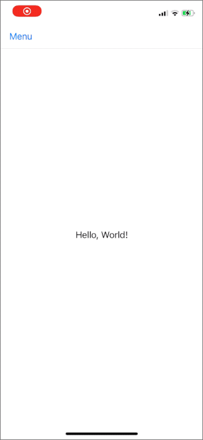

# Side Menu Transition

## 📝 Description

Example implemenation of interactive view controller transition for presenting side menu in iOS app.

## 🛠 Tech stack

- [Xcode](https://developer.apple.com/xcode/) v12.2
- [Swift](https://swift.org/) v5.3.1

## 📄 License

Copyright © 2020 Dariusz Rybicki Darrarski

License: [MIT](LICENSE)
